# FLOWCHART SISTEM APLIKASI MOBILE POS

---

FLOWCHART SISTEM APLIKASI MOBILE POS

├── A. FLOWCHART ADMIN / OWNER
│   ├── Flowchart Utama Admin
│   ├── Flowchart Kelola Produk
│   ├── Flowchart Kelola Stok
│   ├── Flowchart Kelola Pengguna
│   ├── Flowchart Kelola Laporan
│   ├── Flowchart Kelola Pengaturan
│   ├── Flowchart Melakukan Transaksi
│   ├── Flowchart Cari Produk
│   ├── Flowchart Kelola Keranjang
│   └── Flowchart Proses Pembayaran
│
└── B. FLOWCHART KASIR
    ├── Flowchart Utama Kasir
    ├── Flowchart Melakukan Transaksi
    ├── Flowchart Cari Produk
    ├── Flowchart Kelola Keranjang
    └── Flowchart Proses Pembayaran

---

## Keterangan Hak Akses

### Admin / Owner
Memiliki akses terhadap:
- Dashboard
- Kelola Produk
- Kelola Stok
- Kelola Pengguna
- Kelola Laporan
- Kelola Pengaturan
- Melakukan Transaksi
- Cari Produk
- Kelola Keranjang
- Proses Pembayaran
- Logout

### Kasir
Memiliki akses terhadap:
- Dashboard
- Melakukan Transaksi
- Cari Produk
- Kelola Keranjang
- Proses Pembayaran
- Logout

---

## Keterangan Flowchart Hak Akses

### A. FLOWCHART ADMIN / OWNER
#### 1. Flowchart Utama Admin
#### 2. Flowchart Kelola Produk
#### 3. Flowchart Kelola Stok
#### 4. Flowchart Kelola Pengguna
#### 5. Flowchart Kelola Laporan
#### 6. Flowchart Kelola Pengaturan
#### 7. Flowchart Melakukan Transaksi
#### 8. Flowchart Cari Produk
#### 9. Flowchart Kelola Keranjang
#### 10. Flowchart Proses Pembayaran

### B. FLOWCHART KASIR
#### 1. Flowchart Utama Kasir
#### 2. Flowchart Melakukan Transaksi
#### 3. Flowchart Cari Produk
#### 4. Flowchart Kelola Keranjang
#### 5. Flowchart Proses Pembayaran

---

## 1. Flowchart Utama Admin / Owner

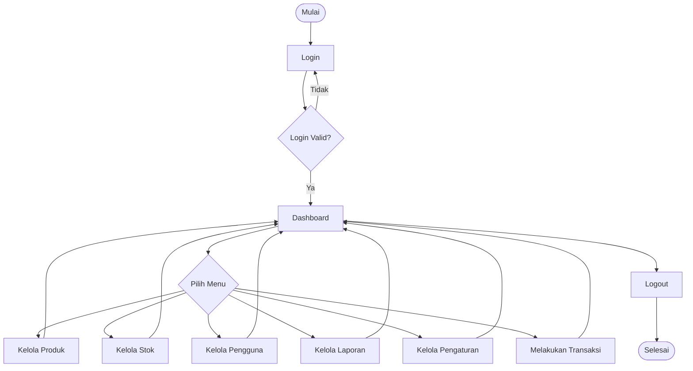

---

## 2. Flowchart Kelola Produk

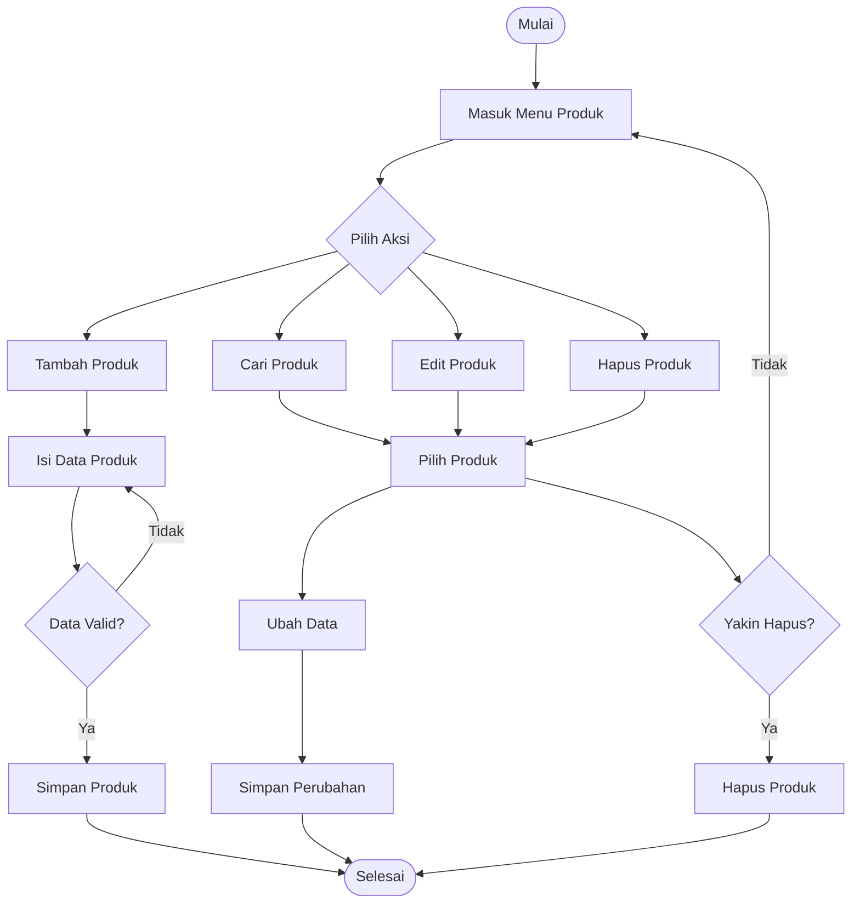

---

## 3. Flowchart Kelola Stok

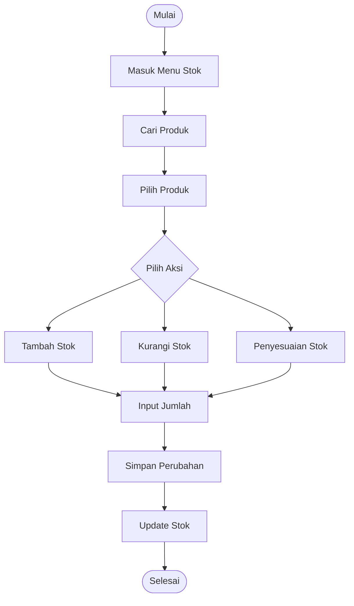

---

## 4. Flowchart Kelola Pengguna

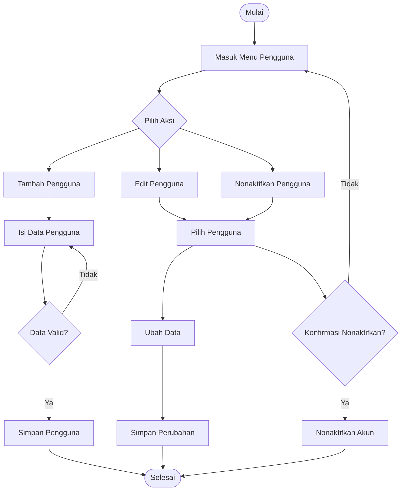

---

## 5. Flowchart Kelola Laporan

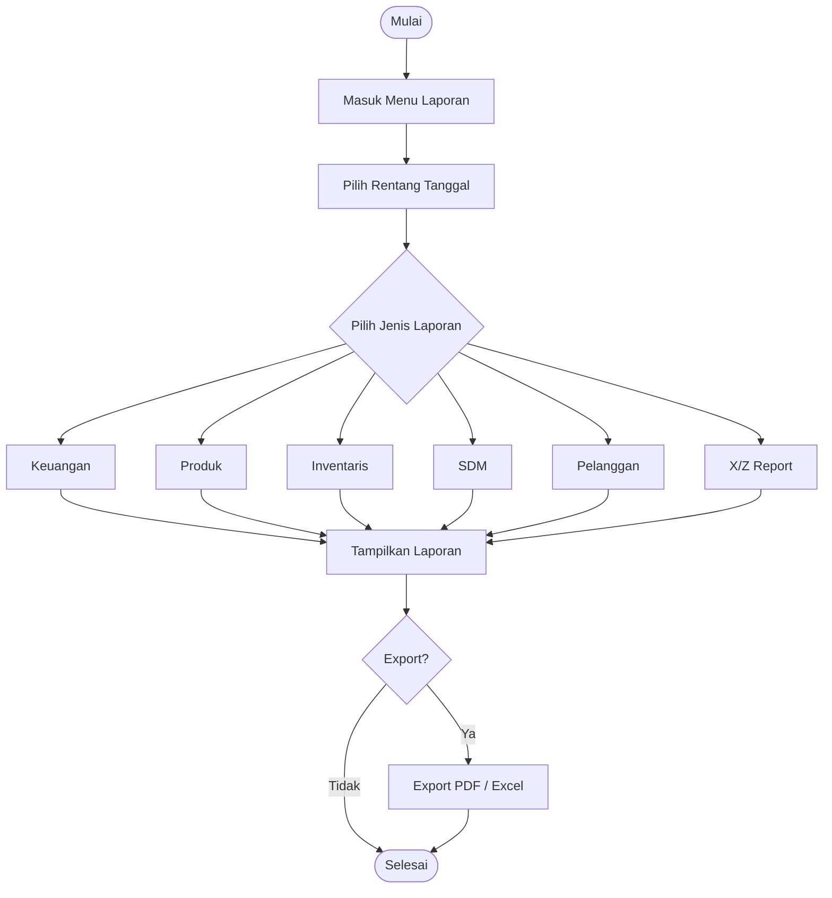

---

## 6. Flowchart Kelola Pengaturan

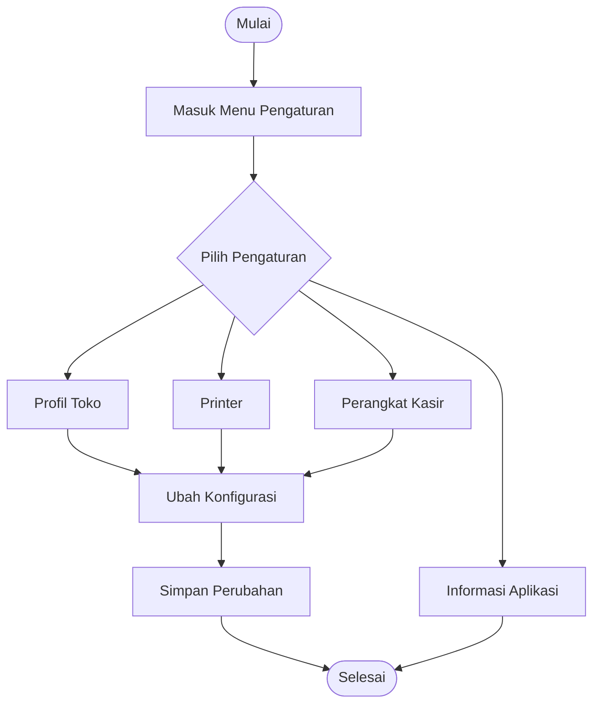

---

## 7. Flowchart Melakukan Transaksi

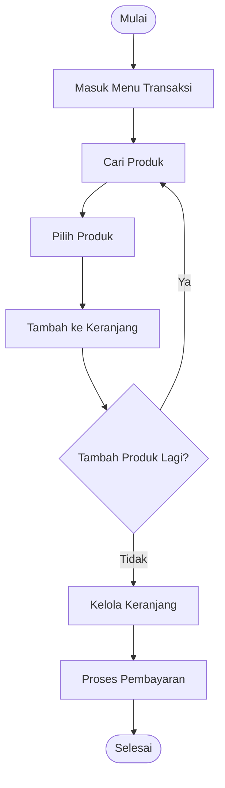

---

## 8. Flowchart Cari Produk

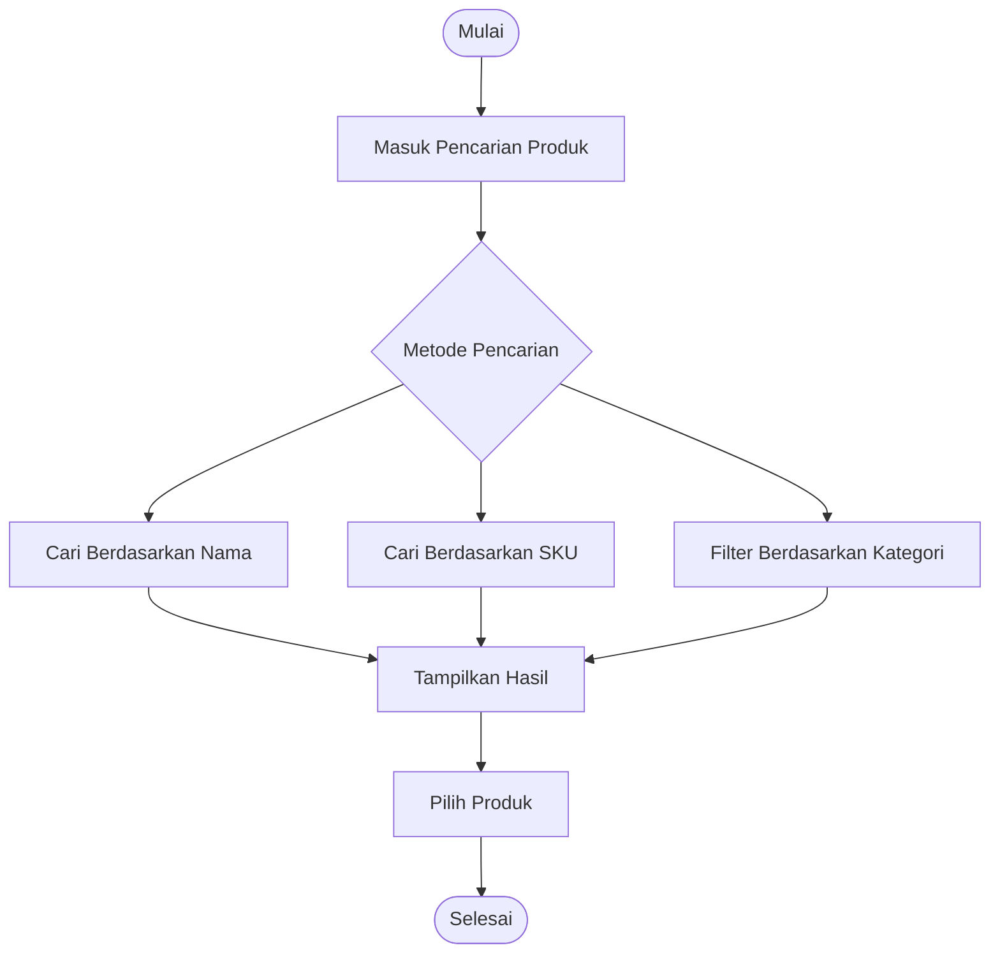

---

## 9. Flowchart Kelola Keranjang

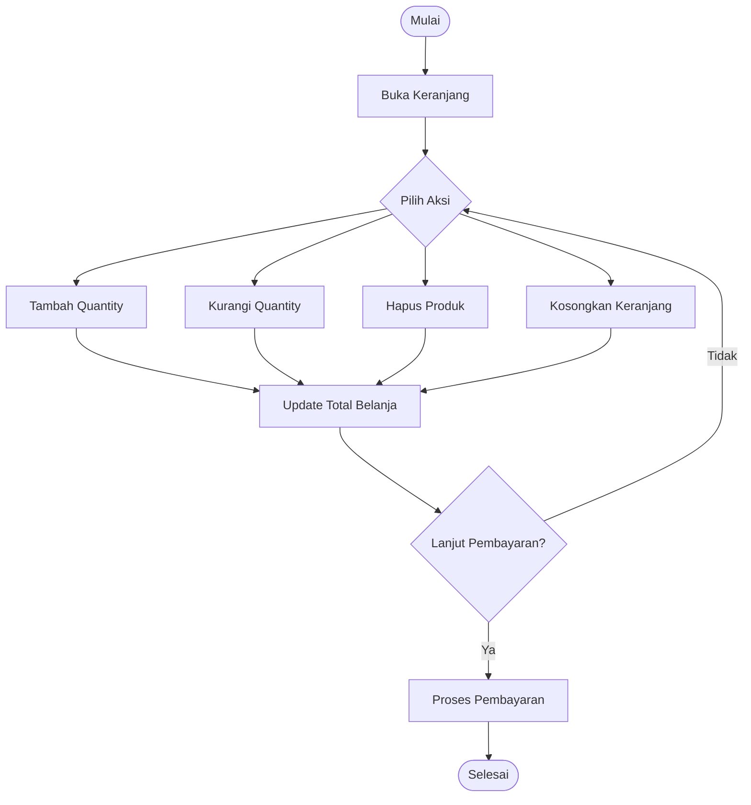

---

## 10. Flowchart Proses Pembayaran

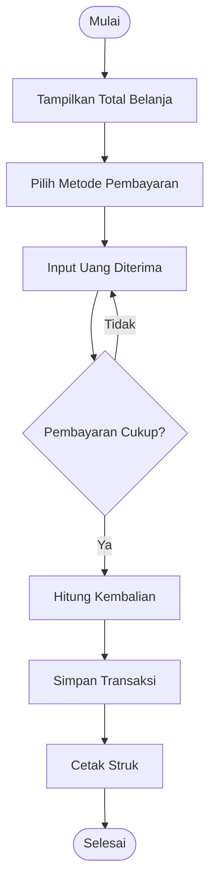

---

## 11. Flowchart Utama Kasir
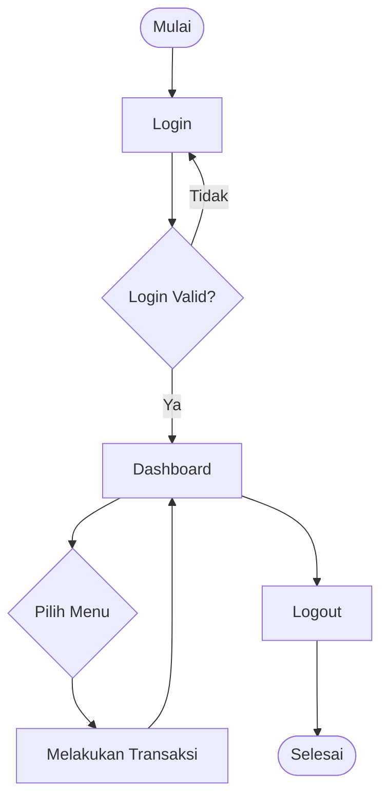