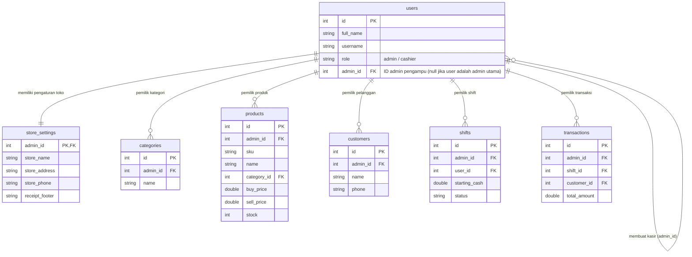

# Rencana Implementasi Sistem Multi-Toko & Isolasi Data Berbasis Admin (Multi-Tenancy)

Dokumen ini berisi rencana arsitektur dan langkah-langkah teknis untuk menerapkan sistem isolasi data berbasis akun toko (*Multi-Tenancy*) pada aplikasi **Mobile POS Flutter**.

---

## 1. Pendahuluan & Konsep Utama

Saat ini, beberapa tabel (seperti `products`, `categories`, `customers`, dan `store_settings`) masih bersifat global atau tunggal (singleton). 

Dengan sistem **Multi-Toko Berbasis Admin**:
1. **Akun Admin:** Merupakan *owner* dari satu unit toko. Semua data bisnis (produk, inventaris, transaksi, shift, laporan, pelanggan, dan pengaturan toko) terikat secara eksklusif ke ID akun Admin tersebut.
2. **Akun Karyawan/Kasir:** Dibuat oleh seorang Admin. Akun kasir menyimpan rujukan `admin_id` milik Admin pembuatnya, sehingga saat kasir login, aplikasi secara otomatis menampilkan toko dan konfigurasi milik Admin pengampunya.
3. **Isolasi Data:** Setiap transaksi, laporan, dan pengaturan yang diakses oleh Admin A tidak akan pernah bercampur atau terlihat oleh Admin B.

---

## 2. Perubahan Skema Database SQLite (`local_database_service.dart`)

Untuk mendukung isolasi data, skema database akan disesuaikan dengan menambahkan kolom rujukan `admin_id` pada setiap tabel utama:



### Detail Perubahan Tabel:

1. **Tabel `users`:**
   - Tambah/pastikan kolom `admin_id INTEGER REFERENCES users(id)`.
   - Untuk **Admin**: `admin_id` nilainya sama dengan `id` user (atau `null`, di mana penanganan fallback mengarah ke `id` user).
   - Untuk **Kasir**: `admin_id` diisi dengan `id` Admin yang membuat akun kasir tersebut.

2. **Tabel `store_settings`:**
   - Ubah dari singleton `CHECK (id = 1)` menjadi tabel terisolasi dengan `admin_id INTEGER PRIMARY KEY REFERENCES users(id)`.
   - Setiap Admin yang baru terdaftar secara otomatis dibuatkan entri default pengaturan tokonya.

3. **Tabel `categories`:**
   - Tambahkan `admin_id INTEGER NOT NULL REFERENCES users(id)`.
   - Batasan Unik diubah menjadi `UNIQUE(admin_id, name)` agar beda toko bisa menggunakan nama kategori yang sama tanpa konflik.

4. **Tabel `products`:**
   - Tambahkan `admin_id INTEGER NOT NULL REFERENCES users(id)`.
   - Batasan SKU diubah menjadi `UNIQUE(admin_id, sku)`.

5. **Tabel `customers`:**
   - Tambahkan `admin_id INTEGER NOT NULL REFERENCES users(id)`.

6. **Tabel `shifts`:**
   - Tambahkan `admin_id INTEGER NOT NULL REFERENCES users(id)`.

7. **Tabel `transactions`:**
   - Tambahkan `admin_id INTEGER NOT NULL REFERENCES users(id)`.

---

## 3. Resolusi Sesi & Penentuan Admin ID (`AuthState` & Riverpod)

Dalam state aplikasi:
- Dibuat provider `currentAdminIdProvider` yang mengekstrak `admin_id` aktif dari pengguna yang sedang login (`currentUser`):
  - Jika `role == 'admin'`, `activeAdminId = currentUser.id`.
  - Jika `role == 'cashier'`, `activeAdminId = currentUser.adminId`.

```dart
final activeAdminIdProvider = Provider<int?>((ref) {
  final user = ref.watch(currentUserProvider);
  if (user == null) return null;
  return user.role == 'admin' ? user.id : user.adminId;
});
```

---

## 4. Perubahan pada Layer Repository & Business Logic

Setiap Repository yang melakukan operasi pembacaan, penambahan, pengeditan, atau penghapusan WAJIB memfilter berdasarkan `admin_id`:

1. **`UserLocalRepository`:**
   - Saat Admin menambahkan Kasir baru, otomatis menyisipkan `admin_id = currentAdminId`.
   - Saat Admin melihat daftar pengguna, hanya menampilkan pengguna yang memiliki `admin_id = currentAdminId`.

2. **`ProductLocalRepository`:**
   - Kueri produk (`getProducts`, `addProduct`, `updateProduct`) memfilter `WHERE admin_id = ?`.
   - Kueri kategori (`getCategories`, `addCategory`) memfilter `WHERE admin_id = ?`.

3. **`TransactionLocalRepository`:**
   - Checkout dan pencatatan shift menyisipkan `admin_id = currentAdminId`.
   - Riwayat transaksi & perhitungan urutan struk harian memfilter `WHERE admin_id = ?`.

4. **`ReportLocalRepository`:**
   - Seluruh agregasi keuangan (omzet, HPP, laba bersih, grafik penjualan, X/Z report) memfilter transaksi berdasarkan `WHERE admin_id = ?`.

5. **`SettingsRepository`:**
   - Membaca dan memperbarui `store_settings` berdasarkan `admin_id = currentAdminId`.

---

## 5. Strategi Inisialisasi Data & Registrasi Akun Admin Baru

- **Sign Up Admin Baru:**
  Saat user mendaftar sebagai Admin baru melalui halaman pendaftaran:
  1. Buat record user baru role `admin`.
  2. Inisialisasi entri `store_settings` awal untuk `admin_id` baru tersebut dengan nama toko bawaan (misal: "Toko [Nama Admin]").
  3. Inisialisasi kategori awal (misal: "Umum" / "Makanan").

- **Migrasi Data Lama (Existing Data):**
  Untuk memastikan data yang sudah dibuat sebelum fitur ini diterapkan tidak hilang:
  - Dijalankan migrasi SQLite otomatis yang memperbarui data eksisting (produk, transaksi, shift, pengaturan) agar terhubung ke Admin default (`id = 1`).

---

## 6. Rencana Pengujian (Testing Plan)

1. **Unit Testing Isolasi Data:**
   - Pengujian registrasi 2 Admin terpisah (Admin A dan Admin B).
   - Pengujian penambahan produk oleh Admin A tidak muncul di katalog Admin B.
   - Pengujian kasir yang dibuat Admin A hanya bisa melihat produk & pengaturan toko milik Admin A.
2. **Unit Testing Laporan & Struk:**
   - Memastikan laporan keuangan Admin A 100% independen dari transaksi Admin B.
   - Memastikan struk transaksi kasir menampilkan nama toko sesuai pengaturan Admin pengampunya.
3. **Integration & Widget Testing:**
   - Pengujian alur login -> switch akun admin/kasir lain -> verifikasi pembaruan tampilan antarmuka (Dashboard, POS, Laporan).

---

## 7. Hal yang Memerlukan Konfirmasi Lebih Lanjut Dari User

Sebelum eksekusi penulisan kode dilakukan, mohon konfirmasi untuk beberapa poin detail berikut:

1. **Pendaftaran Admin Baru (Sign Up):**
   - Apakah saat pendaftaran akun Admin baru, user diminta menginputkan Nama Toko langsung di form pendaftaran, atau menggunakan nama default terlebih dahulu yang nanti bisa diubah di Pengaturan Toko?
2. **Penghapusan / Status Nonaktif Kasir:**
   - Ketika seorang Admin menonaktifkan atau menghapus akun kasir, apakah transaksi historis yang pernah dilakukan oleh kasir tersebut tetap harus tersimpan dalam laporan toko Admin tersebut? (Rekomendasi: Ya, transaksi tetap disimpan).
3. **Kasir yang Membuat Shift / Transaksi:**
   - Jika satu toko Admin memiliki 3 kasir, apakah semua kasir tersebut saling melihat produk & transaksi dalam toko yang sama? (Rekomendasi: Ya, karena mereka berada dalam 1 toko milik Admin yang sama).
