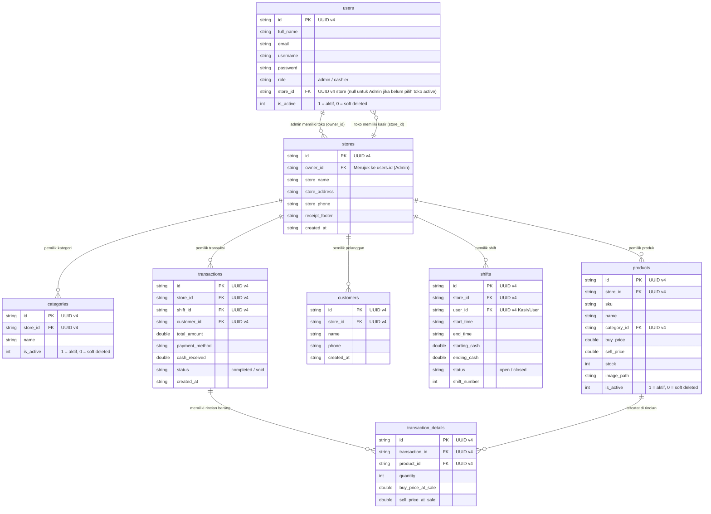

# Rencana Implementasi Sistem Multi-Toko & Isolasi Data (Multi-Tenancy) - Versi Terakhir (Revisi)

Dokumen ini merupakan **rencana arsitektur dan panduan teknis yang telah direvisi** untuk menerapkan isolasi data multi-toko (*Multi-Tenancy*) pada aplikasi **Mobile POS Flutter** dengan pendekatan **Shared Database, Shared Schema**.

---

## 1. Pendahuluan & Pergeseran Arsitektur Utama

Berdasarkan revisi strategi terkini, sistem isolasi data ditingkatkan untuk menjamin skalabilitas multi-cabang di masa depan (*cloud-sync ready*) dan menjaga integritas data *offline-first*:

1. **Pergeseran Pengikat Utama (Tenant ID): Dari `admin_id` ke `store_id`**
   - Operasional toko tidak lagi diikat langsung ke akun `admin_id`, melainkan ke entitas tabel `stores` (*store_id*).
   - Akun **Admin (Owner)** memiliki satu atau lebih entitas toko di tabel `stores` (`owner_id = user.id`).
   - Akun **Karyawan/Kasir** terikat pada `store_id` tempat ia ditugaskan oleh Admin.
   - Semua kasir yang memiliki `store_id` yang sama akan berbagi katalog produk, inventaris, dan konfigurasi toko yang sama.

2. **Penggunaan Primary Key berbasis UUID v4 (`TEXT`)**
   - Seluruh *Primary Key* (PK) dan *Foreign Key* (FK) pada tabel operasional dan master menggunakan format **UUID v4 (`TEXT`)**, bukan `INTEGER AUTOINCREMENT`.
   - Hal ini mencegah bentrokan ID (*ID collision*) apabila data dari beberapa perangkat disinkronisasikan di masa depan.

3. **Penerapan Soft Delete (`is_active`)**
   - Penghapusan data master (seperti kasir, produk, dan kategori) tidak menggunakan perintah SQL `DELETE`.
   - Menggunakan kolom `is_active` (`INTEGER`: 1 = aktif, 0 = nonaktif/dihapus) untuk menjaga integritas relasi tabel transaksi historis dan laporan keuangan.

4. **Pengindeksan Majemuk (*Composite Indexing*)**
   - Ditambahkan indeks majemuk pada tabel operasional (seperti `store_id + sku` dan `store_id + created_at`) untuk menjamin kecepatan kueri saat volume data membesar.

---

## 2. Skema Database SQLite Terintegrasi (`local_database_service.dart`)

Berikut adalah *Entity Relationship Diagram (ERD)* yang telah disesuaikan:



### Constraints & Indexes:
- **`products`:** Batasan `UNIQUE(store_id, sku)`
- **`categories`:** Batasan `UNIQUE(store_id, name)`
- **Indeks:**
  ```sql
  CREATE INDEX idx_products_store ON products(store_id);
  CREATE INDEX idx_transactions_store ON transactions(store_id);
  CREATE INDEX idx_shifts_store ON shifts(store_id);
  CREATE INDEX idx_users_store ON users(store_id);
  ```

---

## 3. Resolusi Sesi & Riverpod Dependency Injection Defensif

Untuk mencegah kebocoran data (*data leak*) antar-toko, *Repository* tidak lagi menerima parameter `store_id` secara manual di setiap method. Sebaliknya, `storeId` diinjeksikan langsung saat inisialisasi Repository melalui Riverpod DI:

### A. Provider Store ID Aktif
```dart
final activeStoreIdProvider = Provider<String?>((ref) {
  final user = ref.watch(currentUserProvider);
  if (user == null) return null;
  
  // Jika user adalah kasir, gunakan store_id milik kasir
  if (user.role == 'cashier') return user.storeId;
  
  // Jika user adalah admin, gunakan store_id aktif miliknya
  return user.storeId;
});
```

### B. Injeksi Defensif ke Provider Repository
```dart
final productRepositoryProvider = Provider<ProductLocalRepository>((ref) {
  final storeId = ref.watch(activeStoreIdProvider);
  if (storeId == null || storeId.isEmpty) {
    throw Exception('Akses ditolak: Tidak ada toko aktif dalam sesi ini');
  }
  final dbService = ref.watch(localDatabaseServiceProvider);
  return ProductLocalRepository(dbService, storeId);
});
```

---

## 4. Perubahan pada Layer Repository & Logika Bisnis

Setiap kelas *Repository* diperbarui untuk menerima `storeId` pada konstruktor dan menerapkan kueri yang aman:

1. **`ProductLocalRepository`:**
   - Pembacaan produk/kategori: `WHERE store_id = ? AND is_active = 1`
   - Penambahan produk/kategori: Otomatis menyisipkan `store_id` dan membuat UUID v4 baru.

2. **`TransactionLocalRepository`:**
   - Pencatatan transaksi & shift: Otomatis menyisipkan `store_id`.
   - Riwayat & urutan transaksi harian: `WHERE store_id = ?`.

3. **`ReportLocalRepository`:**
   - Agregasi Keuangan, Top Products, X/Z Report dikalkulasi murni berdasarkan `WHERE store_id = ?`.

4. **`UserLocalRepository`:**
   - Admin hanya dapat melihat daftar kasir toko: `WHERE store_id = ? AND is_active = 1`.
   - Penghapusan Kasir: Menjalankan *Soft Delete* (`UPDATE users SET is_active = 0 WHERE id = ?`). Riwayat transaksi kasir yang dinonaktifkan tetap utuh di tabel `transactions`.

5. **`SettingsRepository`:**
   - Membaca dan mengedit informasi toko dari tabel `stores` menggunakan `WHERE id = ?` (`storeId`).

---

## 5. Strategi Onboarding (Sign Up Admin) & Migrasi Data

1. **Form Pendaftaran Admin Baru (Sign Up):**
   - Form pendaftaran mencakup input wajib **Nama Toko** selain Nama Lengkap, Username, Email, dan Password.
   - Proses pendaftaran:
     1. Buat UUID v4 untuk Admin & UUID v4 untuk Toko.
     2. Simpan record di tabel `users` (`role = 'admin'`, `store_id = newStoreId`).
     3. Simpan record di tabel `stores` (`id = newStoreId`, `owner_id = newAdminId`, `store_name = inputNamaToko`).
     4. Inisialisasi kategori default (misal: "Umum").

2. **Migrasi Data Lama (Database Migration v1 -> v2):**
   - Untuk data eksisting sebelum pembaruan ini:
     1. Buat UUID v4 default untuk toko lama.
     2. Migrasikan tabel `store_settings` lama ke tabel `stores`.
     3. Konversi seluruh Primary Key dari `INTEGER` ke `UUID v4`.
     4. Hubungkan seluruh `users`, `products`, `categories`, `customers`, `shifts`, dan `transactions` eksisting ke `store_id` default tersebut.

---

## 6. Rencana Pengujian (Testing Plan)

1. **Unit Testing Isolasi Multi-Toko:**
   - Memastikan dua toko berbeda (Store A dan Store B) tidak saling membaca produk, transaksi, atau kategori satu sama lain.
   - Memastikan kueri master hanya mengembalikan item dengan `is_active = 1`.
2. **Unit Testing Soft Delete:**
   - Memastikan kasir yang dinonaktifkan (`is_active = 0`) hilang dari daftar kasir aktif, tetapi transaksinya tetap terhitung di laporan keuangan toko.
3. **Integration Testing Riverpod DI:**
   - Memastikan pergantian akun/sesi user secara otomatis memicu pembaruan `activeStoreIdProvider` dan me-refresh seluruh data tampilan (Dashboard, POS, Laporan).

---

## 7. Status Kesiapan Eksekusi (Readiness Assessment)

> **KESIMPULAN: Rencana implementasi ini 100% SIAP DIEKSEKUSI.**

 Seluruh spesifikasi arsitektur (*Shared Database Shared Schema*, `store_id` sebagai Tenant ID, UUID v4, *Soft Delete*, *Defensive Riverpod DI*, serta alur *Sign Up* Admin dengan *Nama Toko*) telah terdefinisi dengan jelas dan konsisten di seluruh layer. Tidak ada ambiguasi tersisa.
