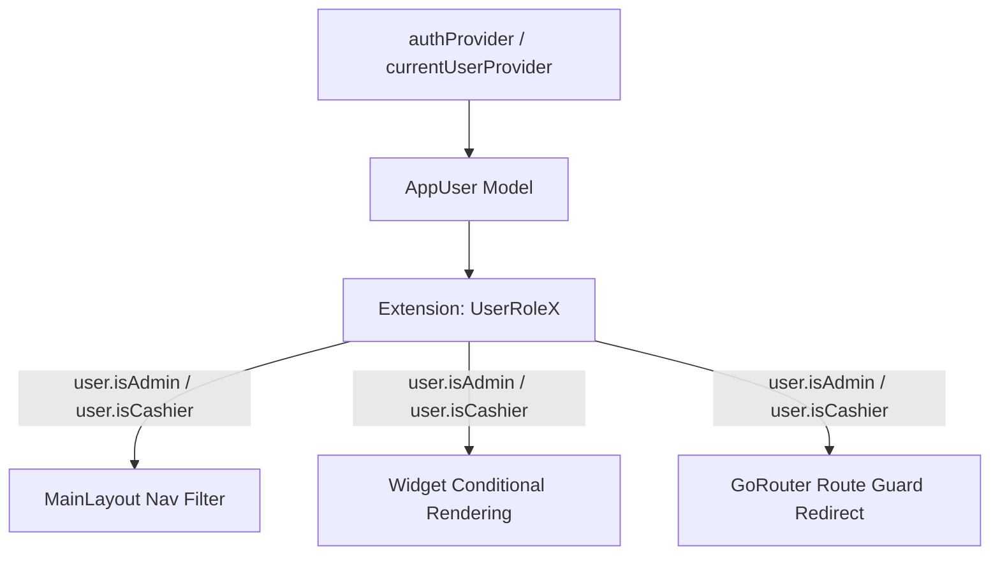

# Rencana Implementasi System Scope & Access Control Role Kasir
## Aplikasi Mobile POS Flutter (Multi-Tenant Offline-First)

**Dokumen Rencana:** `dokumentasi/rencana_implementasi_role_kasir.md`  
**Tanggal:** 7 Agustus 2026  
**Prinsip Desain:** *Minimal Invasive, Non-Disruptive, Single Source of Truth, & Maintainable*

---

## 🎯 1. Tujuan & Analisis Kebutuhan Scope Role Kasir

Rencana implementasi ini bertujuan untuk membatasi hak akses (*Role-Based Access Control / RBAC*) pengembang/pengguna dengan role **Kasir** (`role == 'kasir'` atau `role == 'cashier'`), agar kasir hanya dapat mengakses fitur operasional harian kasir tanpa dapat melihat informasi finansial sensitif (seperti laba bersih/harga beli) atau mengubah pengaturan sistem/toko.

### Matriks Batasan Hak Akses (Role-Permission Matrix)

| Area Aplikasi | Fitur / Sub-Menu | Akses Admin | Akses Kasir | Perilaku UI & Logika Scoping |
|---|---|---|---|---|
| **Navigasi Utama** | Tab Bar (BottomNav / Rail) | Dashboard, POS, Produk, Laporan, Lainnya | Dashboard, POS, Produk, Lainnya | Tab **Laporan** disembunyikan dari navigasi kasir. |
| **Dashboard** | PerformanceSummary Widget | Penjualan, Transaksi, Laba Bersih | Penjualan, Transaksi | Widget **Laba Bersih** disembunyikan / di-filter. |
| **Dashboard** | Quick Actions Widget | Tambah Produk, Cetak Laporan | Sesuai Akses Kasir | Menyembunyikan tombol pintas yang membutuhkan hak akses Admin. |
| **Menu Transaksi** | POS Checkout, Keranjang, Struk | Full Access | Full Access | Kasir dapat melakukan seluruh transaksi kasir secara penuh. |
| **Menu Produk** | Header Action | Tambah Produk (Aktif) | Disembunyikan / Nonaktif | Tombol "Tambah Produk" disembunyikan dari kasir. |
| **Menu Produk** | Item Card & Detail | Edit, Hapus, Harga Beli & Jual | Hanya Lihat Nama, Stok, & Harga Jual | Sembunyikan **Harga Beli** dan tombol aksi **Edit / Hapus**. |
| **Menu Lainnya** | Settings Page | Profil, User Staff, Toko, Hardware, Logout | **Hanya Logout** | Menyembunyikan grup pengaturan sensitif, hanya menampilkan tombol **Logout**. |
| **Keamanan Rute** | GoRouter Protection | Semua Rute | Terbatas Rute Kasir | Redirect otomatis ke `/dashboard` jika kasir mencoba membuka `/reports` atau `/settings/users`. |

---

## 🏗️ 2. Strategi Arsitektur (Clean & Minimal Invasive)

Untuk menjaga kode tidak berantakan (*spaghetti code*) dan mudah dirawat di kemudian hari, kita menerapkan strategi **Centralized Role Extension & Conditional Rendering**:



1. **Central Single Source of Truth:** Membuat Extension `UserRoleX` pada `AppUser?` di `lib/core/utils/role_extension.dart` yang menangani pengecekan case-insensitive (`admin`, `kasir`, `cashier`).
2. **Declarative Navigation Scoping:** `MainLayout` membaca `authProvider` untuk menyaring (*filter*) tab navigasi secara dinamis.
3. **Reusable Conditional Widget:** Menggunakan pengecekan sederhana `if (user.isAdmin)` pada level UI widget tanpa merombak struktur widget atau repositori data yang ada.

---

## 🛠️ 3. Rincian Langkah Implementasi Teknis (Step-by-Step Execution Plan)

### Langkah 1: Pembuatan Helper Role Extension Terpusat
**File:** `lib/core/utils/role_extension.dart`
- Membuat extension pada `AppUser?` untuk metode pembantu:
  ```dart
  extension UserRoleX on AppUser? {
    bool get isAdmin => this?.role.toLowerCase() == 'admin';
    bool get isCashier => !isAdmin;
  }
  ```
- **Keunggulan:** Jika di masa depan ada penambahan role baru (misal: `manager`), perubahan logika cukup dilakukan di 1 file ini.

---

### Langkah 2: Scoping Navigasi Utama & Tab Bar
**File:** `lib/features/dashboard/presentation/main_layout.dart`
- Membaca `ref.watch(authProvider)` di `MainLayout`.
- Menyesuaikan indeks tab dan menyembunyikan cabang `Laporan` (index 3) jika `user.isCashier`.
- Mapping indeks rute StatefulShellRoute agar kasir berpindah dengan mulus antara Dashboard (0), POS (1), Produk (2), dan Lainnya (3/4).

---

### Langkah 3: Scoping Halaman Dashboard & Widget Laba Bersih
**File:** `lib/features/dashboard/presentation/widgets/performance_summary.dart` & `dashboard_page.dart`
- Pada `PerformanceSummary`, baca status `user` dari Riverpod `authProvider`.
- Filter item `Laba Bersih` dari list `stats`:
  ```dart
  if (!user.isAdmin) {
    stats.removeWhere((item) => item.label == 'Laba Bersih');
  }
  ```
- Pada `QuickActionsWidget`, sembunyikan atau sesuaikan tombol pintas yang membutuhkan hak akses admin.

---

### Langkah 4: Scoping Halaman Produk (Tanpa Tambah, Edit, & Harga Beli)
**File:** `lib/features/products/presentation/products_page.dart`
- Read `ref.watch(authProvider)` di `ProductsPage`.
- **Tombol Tambah Produk (Header):**
  ```dart
  if (user.isAdmin)
    ElevatedButton.icon(
      onPressed: () => _showProductForm(context, null),
      icon: const Icon(Icons.add),
      label: const Text('Tambah'),
    ),
  ```
- **Card Produk (Harga Beli):** Sembunyikan teks `Text('Beli: Rp ...')` jika `!user.isAdmin`.
- **Card Produk (Tombol Edit & Hapus):** Sembunyikan kolom `IconButton(Icons.edit_outlined)` dan `IconButton(Icons.delete_outline)` jika `!user.isAdmin`.
- **Guard Modal Form:** Tambahkan proteksi di awal fungsi `_showProductForm` agar modal tidak bisa dibuka jika `user.isCashier`.

---

### Langkah 5: Scoping Halaman Pengaturan / Lainnya (Hanya Logout)
**File:** `lib/features/settings/presentation/settings_page.dart`
- Read `ref.watch(authProvider)` di `SettingsPage`.
- Jika `user.isCashier`:
  - Sembunyikan `_SettingsGroup` untuk Profil, Manajemen User, Pengaturan Toko, dan Hardware.
  - Tampilkan Card Ringkasan Pengguna (Nama & Role Kasir) dan Tombol Utama **Logout**.

---

### Langkah 6: Pengamanan Route Guard Declarative (GoRouter)
**File:** `lib/core/router/app_router.dart`
- Tambahkan logika pengecekan role di dalam fungsi `redirect` `GoRouter`:
  ```dart
  final user = ref.read(authProvider);
  if (user != null && user.isCashier) {
    final location = state.uri.toString();
    if (location.startsWith('/reports') || 
        location == '/settings/users' || 
        location == '/settings/store') {
      return '/dashboard'; // Redirect kasir yang mencoba ketik URL terlindungi
    }
  }
  ```

---

### Langkah 7: Pengujian Otomatis (Role Scoping Test Suite)
**File:** `test/features/auth/role_scoping_test.dart`
- Membuat unit/widget test khusus untuk memverifikasi:
  1. Login sebagai `kasir` -> `Laba Bersih` tidak ter-render di Dashboard.
  2. Login sebagai `kasir` -> Tombol Tambah, Edit, & Teks Harga Beli tidak ter-render di Halaman Produk.
  3. Login sebagai `kasir` -> Halaman Settings hanya menampilkan tombol Logout.
  4. Redirect GoRouter menolak kasir mengakses `/reports`.

---

## 📋 4. Checklist Rencana Eksekusi (Implementation Milestones)

- [ ] **Phase 1:** Buat `lib/core/utils/role_extension.dart`.
- [ ] **Phase 2:** Update `main_layout.dart` untuk penyaringan tab navigasi Kasir.
- [ ] **Phase 3:** Update `performance_summary.dart` & `dashboard_page.dart` (Sembunyikan Laba Bersih).
- [ ] **Phase 4:** Update `products_page.dart` (Sembunyikan Tambah, Edit, Hapus, & Harga Beli).
- [ ] **Phase 5:** Update `settings_page.dart` (Hanya tampilkan tombol Logout untuk Kasir).
- [ ] **Phase 6:** Update `app_router.dart` dengan Route Guard role Kasir.
- [ ] **Phase 7:** Buat dan jalankan `test/features/auth/role_scoping_test.dart` (`flutter test`).

---

## 🚀 5. Kesimpulan Rencana

Rencana implementasi ini dirancang **100% modular dan non-invasive**. Seluruh fitur yang sudah berjalan (seperti POS Checkout, SQLite transactions, Laporan Keuangan Admin) tetap utuh tanpa risiko *breakage*. Dengan menggunakan `Role Extension` terpusat dan Riverpod state management yang sudah ada, aplikasi akan sangat mudah dipelihara (*maintainable*) dan siap diuji coba.
