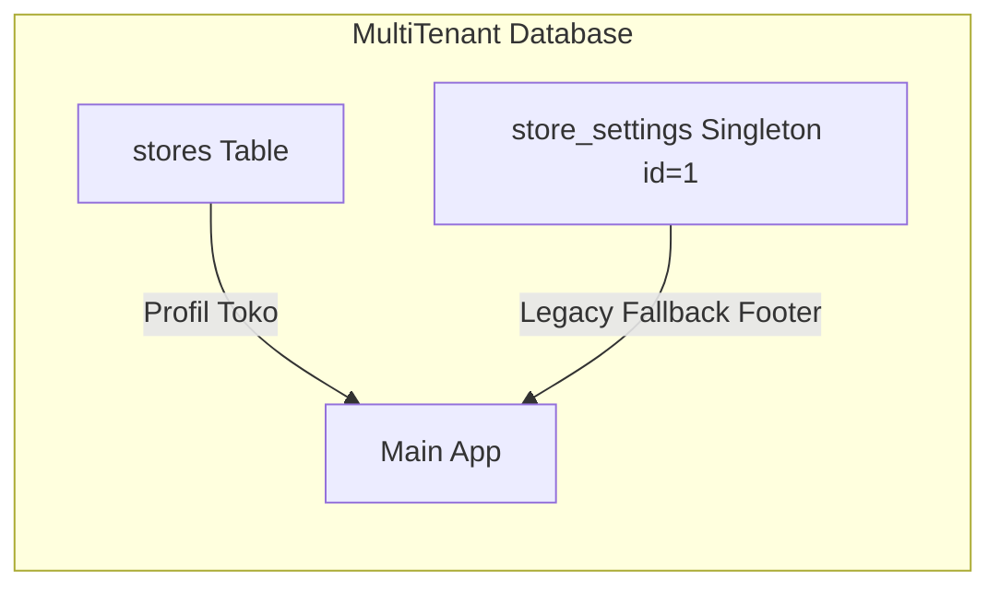
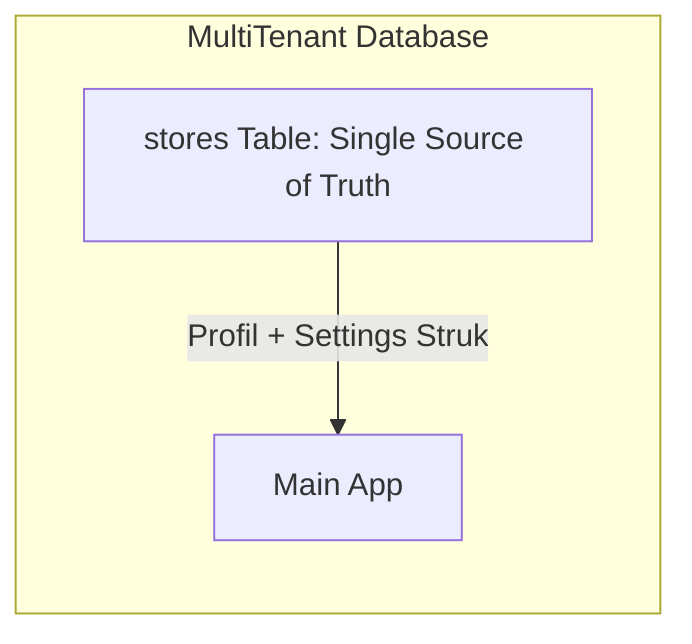

# Rencana Implementasi Penggabungan Tabel `store` & `store_setting`
## Aplikasi Mobile POS Flutter (Multi-Tenant Offline-First)

**Dokumen Rencana:** `dokumentasi/rencana_penggabungan_tabel_store.md`  
**Tanggal:** 7 Agustus 2026  
**Prinsip Desain:** *Single Source of Truth, Multi-Tenant Native, Zero Data Loss, & Clean Architecture*

---

## 🎯 1. Tujuan Utama & Alasan Penggabungan

Rencana ini bertujuan untuk **mengeliminasi redundansi basis data** dengan menggabungkan tabel legacy singleton `store_settings` ke dalam tabel master multi-tenant `stores`. 

### Keuntungan Utama Penggabungan:
1. **Pengaturan Struk Per-Toko (Multi-Tenant Native):** Setiap toko (Toko A, Toko B) memiliki footer struk dan alamat tersendiri tanpa konflik *singleton*.
2. **Eliminasi Redundansi Data:** Menghapus kolom duplikat (`store_name`, `store_address`, `store_phone`, `receipt_footer`) di 2 tabel terpisah.
3. **Penyederhanaan Kueri SQLite:** Menghapus blok kode *try-catch fallback* pada `SettingsLocalRepository`.
4. **Efisiensi Database:** Mengurangi beban migrasi dan pemeliharaan skema SQLite.

---

## 📊 2. Matriks Perbandingan Skema Sebelum & Sesudah

### Sebelum (Current 2-Tables Architecture)


### Sesudah (Proposed Unified `stores` Table)


### Skema Akhir Tabel `stores` (Merged Schema)
| Kolom | Tipe Data | Constraint | Deskripsi |
|---|---|---|---|
| `id` | TEXT | PRIMARY KEY | ID unik Toko (UUID / Timestamp) |
| `owner_id` | TEXT | NOT NULL | User ID pemilik toko (Admin) |
| `store_name` | TEXT | NOT NULL | Nama Toko |
| `store_address` | TEXT | | Alamat Toko |
| `store_phone` | TEXT | | Nomor telepon Toko |
| `receipt_footer` | TEXT | DEFAULT 'Terima kasih...' | Pesan di bawah struk belanja toko |
| `created_at` | TIMESTAMP | DEFAULT CURRENT_TIMESTAMP | Tanggal pembuatan toko |

---

## 🛠️ 3. Rincian Langkah Eksekusi Teknis (Step-by-Step Implementation)

### Langkah 1: Pembaruan Skema Database (`local_database_service.dart`)
**File:** `lib/core/data/local_database_service.dart`
1. Hapus sintaks `CREATE TABLE store_settings (...)` dari pembuatan tabel SQLite.
2. Hapus perintah `await db.insert('store_settings', ...)` pada fungsi seeding awal.
3. Tambahkan migrasi SQLite (jika `db.version` dinaikkan ke v2):
   ```sql
   DROP TABLE IF EXISTS store_settings;
   ```

---

### Langkah 2: Refactoring Repository Layer (`settings_local_repository.dart`)
**File:** `lib/features/settings/data/settings_local_repository.dart`
1. Pada fungsi `updateSettings()`, hapus blok pembaruan *legacy fallback*:
   ```dart
   // HAPUS BLOK INI:
   // try { await db.update('store_settings', ...); } catch (_) {}
   ```
2. Pastikan fungsi `getSettings()` dan `updateSettings()` MURNI beroperasi 100% pada tabel `stores` menggunakan parameter `storeId`.

---

### Langkah 3: Verifikasi Layer UI & Provider (`store_settings_page.dart`)
**File:** `lib/features/settings/presentation/store_settings_page.dart` & `settings_provider.dart`
1. Pastikan modal / form pengisian pengaturan toko membaca dan menyimpan data secara langsung melalui `settingsProvider` yang terhubung ke tabel `stores`.
2. Verifikasi bahwa pencetakan struk transaksi (`transaction_receipt_widget.dart`) mengambil nilai `receipt_footer` dari toko aktif.

---

### Langkah 4: Pembaruan Dokumentasi Skema SQLite (`sqlite_schema.md`)
**File:** `dokumentasi/sqlite_schema.md`
1. Hapus deskripsi tabel `1.6 store_settings`.
2. Perbarui bagian tabel `1.1 stores` dengan menyantumkan kolom `receipt_footer` sebagai komponen resmi dari entitas toko.

---

### Langkah 5: Eksekusi Test Suite & Validasi Statis
**Command:** `flutter analyze` & `flutter test`
1. Jalankan `flutter analyze` untuk memastikan **0 Error / 0 Warning**.
2. Jalankan seluruh test suite unit & widget test (`flutter test`) untuk memverifikasi tidak ada kebocoran atau kerusakan fungsi.

---

## 📋 4. Checklist Rencana Eksekusi (Implementation Checklist)

- [ ] **Step 1:** Refactor `lib/core/data/local_database_service.dart` (Hapus DDL & Seeding `store_settings`).
- [ ] **Step 2:** Refactor `lib/features/settings/data/settings_local_repository.dart` (Hapus fallback `store_settings`).
- [ ] **Step 3:** Verifikasi UI Pengaturan Toko & Pencetakan Struk.
- [ ] **Step 4:** Update dokumentasi `dokumentasi/sqlite_schema.md`.
- [ ] **Step 5:** Jalankan `flutter analyze` & `flutter test` untuk konfirmasi 100% Pass Rate.

---

## 🚀 5. Kesimpulan Rencana

Dengan mengonsolidasikan tabel `store_settings` ke dalam tabel `stores`, aplikasi Mobile POS Flutter akan memiliki **arsitektur basis data yang jauh lebih bersih, konsisten untuk multi-tenant, dan lebih mudah dipelihara di masa depan**.
