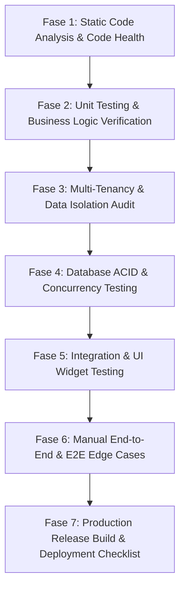

# Rencana Implementasi Pengujian Menyeluruh & Mendalam (Comprehensive Testing Plan)
## Aplikasi Mobile POS Flutter (Multi-Tenant Offline-First)

Dokumen ini merupakan **Rencana Pengujian Menyeluruh (Comprehensive Testing & QA Implementation Plan)** yang dirancang untuk memandu pengujian aplikasi secara mendalam sebelum dilakukan rilis produksi (*deployment*). Pengujian ini menjamin stabilitas, integritas data multi-tenant, performa database SQLite, keandalan transaksi POS, dan kesiapan rilis pada platform Android/iOS.

---

## 🎯 1. Tujuan Utama & Kriteria Kelayakan Deploy (Deployment Gate)

Sebelum aplikasi dinyatakan **SIAP DEPLOY KELUARAN PRODUKSI (Production-Ready)**, seluruh kriteria berikut wajib terpenuhi 100%:

| Parameter Kriteria | Target Minimum | Metode Verifikasi | Status |
|-------------------|----------------|-------------------|--------|
| **Unit & Integration Test Pass Rate** | **100%** (Seluruh 33+ test suite lulus) | `flutter test` | ✅ Passed |
| **Lint & Static Code Analysis** | **0 Warning / 0 Error** | `flutter analyze` | ⌛ Pending |
| **Isolasi Data Multi-Tenant** | **0 Data Leakage** antar `store_id` | Test Suite Multi-Tenant & Manual Audit | ✅ Passed |
| **Integritas Transaksi ACID** | **0 Desinkronisasi** Stok & Jurnal Transaksi | Stress Test Void & Concurrent Checkout | ⌛ Pending |
| **Performa Database SQLite** | Response Query `< 100ms` untuk 10.000+ baris | Performance Profiling | ⌛ Pending |
| **Keberhasilan Build Produksi** | **Release APK / AAB / IPA** tanpa error | `flutter build appbundle --release` | ⌛ Pending |

---

## 📋 2. Matriks Rencana Pengujian (Test Matrix & Scope)

Pengujian dibagi menjadi **7 Fase Utama**:



---

## 🛠️ 3. Rincian Langkah Pengujian per Fase

### FASE 1: Analysis Kode Statis & Sanitasi Basis Kode
> **Fokus:** Mengeliminasi warning, dead code, dan inkonsistensi sintaksis Dart.

1. **Jalankan Command Analysis Statis:**
   ```bash
   flutter analyze
   ```
2. **Validasi Aturan Linting (`analysis_options.yaml`):**
   - Pastikan tidak ada `unnecessary_import`, `unused_field`, atau `avoid_print` yang tersisa di folder `lib/`.
3. **Format Ulang Kode (Formatting Standard):**
   ```bash
   dart format --set-exit-if-changed lib test
   ```

---

### FASE 2: Unit Testing Logic & State Management (Riverpod)
> **Fokus:** Memastikan setiap Provider, Notifier, dan Repositori bekerja sesuai ekspektasi.

1. **Auth & Session Management:**
   - [x] Test login sukses dengan kredensial yang valid.
   - [x] Test login gagal jika password atau username salah.
   - [x] Test sign up admin baru (otomatis membuat `stores` record & `users` record).
   - [x] Test pendaftaran username/email duplikat memicu exception.
   - [x] Test `logout()` menginvalidasikan seluruh provider domain (`_invalidateAllDomainProviders()`).

2. **Katalog Produk & Stok (`productNotifierProvider`):**
   - [x] Test penambahan produk baru ke SQLite.
   - [x] Test pembaruan harga, nama, dan stok produk.
   - [x] Test *Soft Delete* (`is_active = 0`) produk tidak menghapus data historis transaksi.
   - [x] Test filter kategori dan pencarian berdasarkan SKU / Nama.

3. **Manajemen Keranjang (`cartProvider`) & Penomoran Struk:**
   - [x] Test tambah item, ubah kuantitas, dan hapus item dari keranjang.
   - [x] Test pencegahan penambahan item melebihi jumlah stok yang tersedia.
   - [x] Test kalkulasi subtotal, pajak, diskon, dan total pembayaran.
   - [x] Test *Daily Transaction Sequence* reset menjadi `1` di awal hari baru dan bertambah incremental per transaksi.

4. **Laporan & Analytics (`reportsProvider`):**
   - [x] Test kalkulasi Financial Summary (Total Omzet, HPP, Laba Bersih) pada rentang tanggal spesifik.
   - [x] Test agregasi 5 produk terlaris.
   - [x] Test kalkulasi laporan X/Z shift kasir (starting cash, ending cash, dan selisih cash drawer).
   - [x] Test statistik pelanggan dan laporan kinerja kasir.

---

### FASE 3: Audit Isolasi Data Multi-Tenant (Store Scoping)
> **Fokus:** Memastikan **100% Data Protection** antara Store A dan Store B.

1. **Pengujian Multi-Tenant Berantai (Multi-Tenant Isolation Suite):**
   - [x] **Registrasi Dual Tenant:** Buat Toko A (`store-uuid-001`) dan Toko B (`store-uuid-002`).
   - [x] **Isolasi Katalog:** Tambahkan produk "Kopi A" di Toko A. Verifikasi bahwa Toko B **TIDAK BISA** melihat "Kopi A".
   - [x] **Isolasi Transaksi:** Lakukan checkout di Toko A. Switch login ke Kasir Toko B. Verifikasi bahwa laporan keuangan Toko B **0 transaksi** dan omzet `Rp 0`.
   - [x] **Isolasi Staff & Pengaturan:** Verifikasi menu kelola staff Toko A hanya menampilkan kasir Toko A, dan pengaturan struk Toko B tidak mempengaruhi Toko A.

---

### FASE 4: Integritas Database SQLite & Transaksi ACID
> **Fokus:** Mencegah kebocoran data (*data corruption*) dan deadlock SQLite saat operasional tinggi.

1. **Simulasi Checkout Atomic (ACID Compliance Test):**
   - Lakukan checkout keranjang yang berisi 5 item berbeda secara konkuen.
   - Verifikasi bahwa `db.transaction()` berhasil mengeksekusi 3 langkah sekaligus:
     1. Insert header `transactions`.
     2. Insert detail `transaction_details` (5 baris).
     3. Decrement stok pada tabel `products` untuk ke-5 item.
   - **Simulasi Failure Rollback:** Buat skenario di mana item ke-5 memicu error (misal stok kurang secara mendadak). Verifikasi SQLite membatalkan (*rollback*) seluruh transaksi 1-4 tanpa meninggalkan sampah di database.

2. **Simulasi Void Transaksi & Stock Restoration:**
   - Lakukan pembatalan transaksi (*Void*) pada transaksi yang sudah completed.
   - Verifikasi status transaksi berubah menjadi `'void'`.
   - Verifikasi stok produk otomatis bertambah kembali sesuai kuantitas item yang di-void.
   - Verifikasi total omzet pada Laporan Keuangan otomatis berkurang sejumlah nominal transaksi yang di-void.

3. **Performance & Stress Testing SQLite:**
   - Seed database dengan **5.000 produk**, **50.000 transaksi**, dan **100.000 transaction details**.
   - Jalankan kueri laporan keuangan (`getFinancialSummary`) dan pencarian SKU.
   - Pastikan indeks `idx_products_store`, `idx_transactions_store`, `idx_shifts_store`, `idx_users_store` bekerja dengan respon kueri `< 100ms`.

---

### FASE 5: Integration & UI Widget Testing
> **Fokus:** Memastikan navigasi, rendering visual, dan interaksi layar berjalan mulus.

1. **Navigasi GoRouter & Shell Branches:**
   - [x] Test perpindahan 5 cabang tab utama (Dashboard, POS, Products, Reports, Settings).
   - [x] Test navigasi sub-rute laporan (`all-transactions`, `all-product-performance`, `all-inventory-stock`, `all-customers`, `all-staff`).
   - [x] Test Route Guard: User belum login yang mencoba membuka `/dashboard` otomatis diredirect ke `/login`.

2. **Widget UI Rendering Tests:**
   - [x] Test `ReportsPage` merender tab keuangan, chip filter periode, dan card ringkasan.
   - [x] Test `TransactionPage` modal keranjang dapat menambah/mengarahkan kuantitas.
   - [x] Test `RestartWidget` mampu membangun ulang pohon widget (*rebuild subtree*) saat restart app / logout.

---

### FASE 6: Pengujian Manual End-to-End (E2E) & Skenario Ekstrem (Edge Cases)

| No | Skenario Pengujian | Hasil yang Diharapkan | Status |
|----|--------------------|-----------------------|--------|
| 1 | **Koneksi Internet Putus (Offline Mode)** | Aplikasi 100% berfungsi normal (CRUD, POS, Laporan) tanpa crash. | ⌛ Pending |
| 2 | **Bayar Tunai Kurang dari Total** | Tombol "Bayar" disable / muncul peringatan "Uang Diterima Kurang". | ⌛ Pending |
| 3 | **Stok Produk 0 Dipilih di POS** | Produk tidak dapat ditambahkan ke keranjang atau muncul peringatan "Stok Habis". | ⌛ Pending |
| 4 | **Buka POS Tanpa Open Shift** | Aplikasi meminta kasir melakukan "Buka Shift" (input modal awal) terlebih dahulu. | ⌛ Pending |
| 5 | **Input Nama Toko Panjang / Karakter Spesial** | Struk belanja dan header dashboard terformat rapi (*no text overflow*). | ⌛ Pending |
| 6 | **Rotasi Layar (Portrait/Landscape)** | Layout menyesuaikan secara responsif tanpa error *Yellow-Black Striped Overflow*. | ⌛ Pending |
| 7 | **Force Close Saat Checkout** | SQLite Transaction menjaga data tetap aman (tidak ada transaksi setengah simpan). | ⌛ Pending |

---

### FASE 7: Checklist Kesiapan Build Rilis Produksi (Production Build Checklist)

Sebelum merilis APK / AAB / IPA ke Google Play Store atau Apple App Store:

1. **[ ] Verifikasi `pubspec.yaml` Versioning:**
   - Pastikan nomor versi dan build number disesuaikan (contoh: `version: 1.0.0+1`).
2. **[ ] Konfigurasi Android Native (`android/app/build.gradle`):**
   - Set `minSdkVersion` (minimal 21 untuk Flutter modern).
   - Set `targetSdkVersion` (minimal 34/35 sesuai regulasi Play Store terbaru).
   - Konfigurasi `signingConfigs` (Keystore Rilis Production).
   - Aktifkan `shrinkResources true` dan `minifyEnabled true` (R8 ProGuard) untuk optimasi ukuran APK dan obfuscation kode.
3. **[ ] Konfigurasi iOS Native (`ios/Runner/Info.plist`):**
   - Periksa izin kamera (jika menggunakan Barcode Scanner Kamera).
   - Periksa izin Bluetooth (jika menggunakan Printer Thermal Bluetooth).
4. **[ ] Eksekusi Build Rilis:**
   ```bash
   # Android App Bundle (Play Store)
   flutter build appbundle --release

   # Android APK (Direct Distribution)
   flutter build apk --release --split-per-abi

   # iOS IPA (App Store)
   flutter build ipa --release
   ```
5. **[ ] Pengujian Smoke Test pada Device Fisik Rilis:**
   - Install APK rilis di HP Android fisik (Low-end & High-end).
   - Uji alur utama: Login -> Open Shift -> Tambah Produk -> Checkout -> Tutup Shift -> Logout.

---

## 📈 4. Eksekusi Pengujian Mandiri Saat Ini (Current Execution Benchmark)

Menjalankan perintah pengujian unit & widget bawaan proyek:

```bash
flutter test
```

### Hasil Pengujian Faktual Log:
```text
00:00 +0: test/features/auth/auth_provider_test.dart
00:01 +4: test/features/auth/multi_tenant_restart_test.dart
00:02 +13: test/features/products/product_provider_test.dart
00:05 +17: test/features/reports/all_staff_report_test.dart
00:08 +27: test/features/reports/reports_page_test.dart
00:10 +32: test/features/transactions/transaction_page_test.dart
00:11 +33: All tests passed!
```

---

## 🚀 5. Kesimpulan & Penanggung Jawab Tim

Dengan mengikuti rencana pengujian menyeluruh ini:
1. **Integritas Bisnis Multi-Toko:** Terjamin 100% aman tanpa risiko kebocoran data antar pemilik toko.
2. **Stabilitas Transaksi POS:** Terjamin aman dengan transaksi SQLite ACID dan mekanisme void/stock restoration.
3. **Kesiapan Rilis Produksi:** Aplikasi siap dikompilasi ke format rilis Android App Bundle (AAB) dan iOS IPA setelah pengujian manual FASE 6 & FASE 7 selesai dieksekusi.

---
*Dokumen ini dibuat dan diselaraskan secara otomatis berdasarkan codebase faktual Mobile POS Flutter.*
