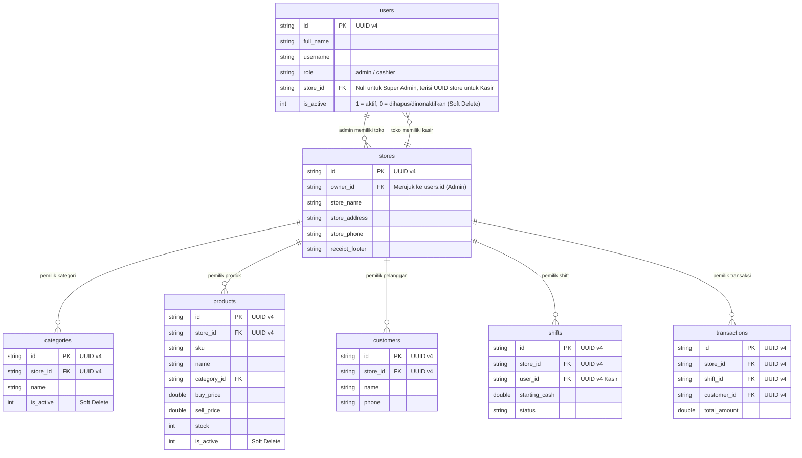

# Instruksi Revisi Rencana Implementasi Sistem Multi-Toko & Isolasi Data (Multi-Tenancy)

Dokumen ini berisi pembaruan strategi dan arsitektur untuk merevisi file `rencana_implementasi_multi_toko.md`. Pendekatan yang digunakan adalah **Shared Database, Shared Schema**, dengan penyesuaian untuk mendukung skalabilitas multi-cabang di masa depan dan menjaga integritas data pada sistem *offline-first*.

---

## 1. Pergeseran Paradigma: Dari `admin_id` ke `store_id`
Alih-alih mengikat seluruh operasional langsung ke akun `admin_id`, sistem akan menggunakan entitas `stores` sebagai pengikat utama (*Tenant ID*). Hal ini krusial agar satu Admin (Owner) di masa depan dapat memiliki lebih dari satu toko/cabang tanpa mencampurkan data transaksinya.

## 2. Standar Baru Tingkat Database (SQLite)
Untuk mendukung isolasi data dan kesiapan sinkronisasi *cloud*:
1. **Penggunaan UUID v4:** Seluruh *Primary Key* (PK) operasional harus menggunakan `TEXT` berisi UUID v4, bukan `INTEGER AUTOINCREMENT`. Ini mencegah bentrokan ID antar-perangkat jika sistem diubah menjadi *cloud-sync* nanti.
2. **Soft Deletes:** Jangan gunakan perintah SQL `DELETE`. Tambahkan kolom `is_active` (INTEGER: 1 aktif, 0 nonaktif) pada tabel master seperti `users` (kasir), `products`, dan `categories` agar riwayat transaksi masa lalu tidak *error* (rusak relasi).
3. **Composite Indexing:** Tambahkan indeks majemuk (contoh: `store_id` + `sku` atau `store_id` + `created_at`) untuk menjaga performa baca tetap stabil saat data membesar.

---

## 3. Revisi Skema Database (Entity Relationship)

Gantikan *Mermaid ER Diagram* lama dengan struktur di bawah ini:



### Detail Batasan (Constraints) & Indeks:
- Tabel `products`: Batasan `UNIQUE(store_id, sku)`.
- Tabel `categories`: Batasan `UNIQUE(store_id, name)`.
- Buat indeks tabel operasional: `CREATE INDEX idx_products_store ON products(store_id);`

---

## 4. Resolusi Sesi & Riverpod yang Defensif

- Buat provider `activeStoreIdProvider` yang akan mengekstrak ID Toko saat ini.
- **Dependency Injection Defensif:** *Repository* tidak lagi menerima parameter `store_id` pada setiap fungsi. *Store ID* diinjeksikan langsung saat inisialisasi Repository melalui Riverpod.

```dart
final activeStoreIdProvider = Provider<String?>((ref) {
  // Logika mendapatkan store_id aktif berdasarkan user/admin yang login
});

final productRepositoryProvider = Provider<ProductLocalRepository>((ref) {
  final storeId = ref.watch(activeStoreIdProvider); 
  if (storeId == null) throw Exception('Akses ditolak: Tidak ada toko aktif');
  return ProductLocalRepository(db, storeId);
});
```

---

## 5. Revisi pada Layer Repository & Logika Bisnis

Setiap fungsi kueri operasional **WAJIB** menerapkan filter:
1. `WHERE store_id = ?` (menggunakan `storeId` yang diinjeksi).
2. `WHERE is_active = 1` (khusus untuk kueri pembacaan data master seperti katalog produk, kategori, dan daftar kasir).

- **Transaksi & Laporan:** Seluruh agregasi (HPP, Omzet, dll) dikalkulasi murni berdasarkan `store_id`, mengabaikan siapa kasir yang melakukan transaksi.

---

## 6. Strategi Onboarding & Pemeliharaan Karyawan

1. **Pendaftaran Admin (Sign Up):**
   - Form pendaftaran WAJIB mencakup *field* **Nama Toko**.
   - Saat submit: Sistem membuat `users` (role = admin), kemudian membuat record di tabel `stores` (dengan *Nama Toko* dari input), lalu jika perlu, mengatur sesi admin agar otomatis terhubung ke `store_id` tersebut.
2. **Penghapusan Kasir:**
   - Saat admin menghapus kasir, sistem menjalankan operasi *Soft Delete* (`UPDATE users SET is_active = 0 WHERE id = ?`).
   - Riwayat transaksi yang dilakukan oleh kasir tersebut tetap utuh di tabel `transactions` dan tetap valid di laporan keuangan.
3. **Kolaborasi Kasir:**
   - Semua kasir yang memiliki `store_id` yang sama akan melihat katalog produk dan laporan *shift* yang sama sesuai hak akses operasional toko tersebut.
